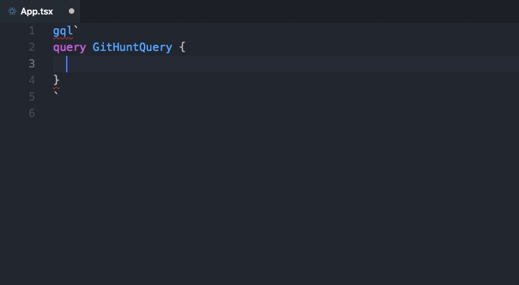
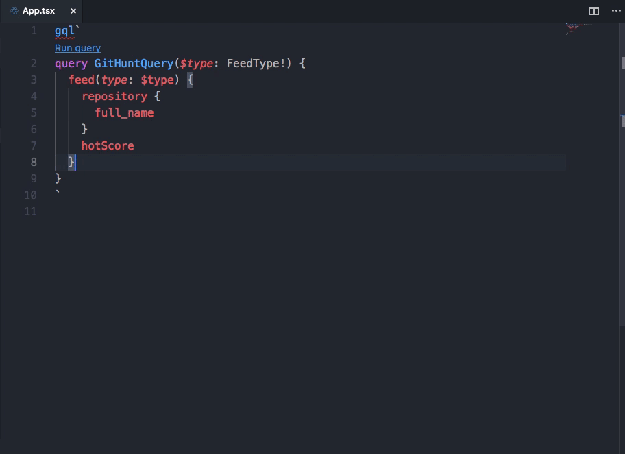
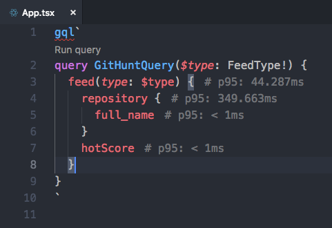

# Apollo VSCode

An all-in-one tooling experience for developing apps with Apollo

- Get instant feedback and intelligent autocomplete as you write queries
- Run queries against your GraphQL server without leaving your editor
- View performance statistics next to your query definitions





## Features

- Loads your GraphQL schemas and queries automatically from an [Apollo Config](https://github.com/apollographql/apollo-cli/blob/master/packages/apollo-cli/README.md#configuration) file
- Adds syntax highlighting for GraphQL files and `gql` templates inside JavaScript files
- Code-completes fields, arguments, types, and variables in your queries
- Lets you run queries, mutations, and subscriptions within the IDE with code-completion for variables
- Displays performance statistics from [Apollo Engine](https://www.apollographql.com/engine) inline with your queries
- Jump-to-definition for fragments and schema types
- Detects fragment references and shows them next to definitions

## How to get it?

Open up VS Code and search for the extension "Apollo".

## How to get it set up?

The extension searches for [Apollo Config](https://github.com/apollographql/apollo-cli/blob/master/packages/apollo-cli/README.md#configuration) definitions in `package.json` or `apollo.config.js` files. To set up a basic endpoint and queries defined in `.tsx` files, a config file would look like.

```js
// package.json

{
  ...,
  "apollo": {
    "schemas": {
      "mainSchema": {
        "endpoint": "http://localhost:4000/graphql"
      }
    }
  }
}
```

## How do we run queries?

The extension enables query execution when an `endpoint` is specified for the schema you are targeting. When you hit `Run query/mutations/subscription`, the extension will open a menu for you to input variables if there are any defined or directly run the query otherwise.

Queries and mutations are executed the same network interface as Apollo Client. Subscriptions are configured to run against the `subscriptions` key in your schema or your endpoint with `http` replaced by `ws` if the key is not defined.

## Troubleshooting

### Extension not starting correctly? Check the logs!

If you're having trouble with the extension not launching or not detecting your configuration files, you can check the language server logs.

1.  Open the VS Code output tab by running the command "View: Toggle Output"
2.  Switch the output view to "Apollo GraphQL"
3.  Check the logs and report any bugs you find!
